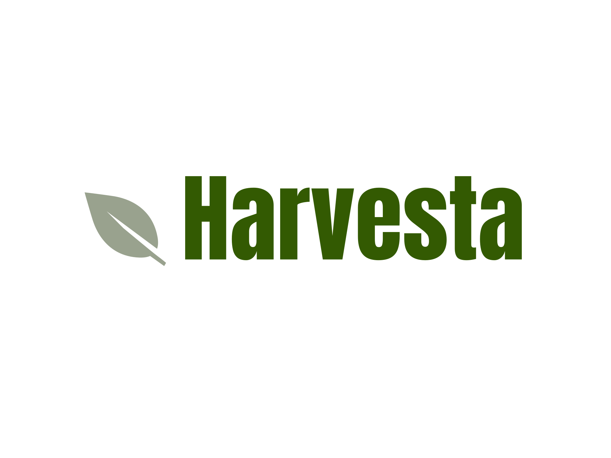

  

# About Harvesta

Harvesta is an innovative online platform that bridges the gap between farmers and consumers, reshaping the traditional supply chain by ensuring fair pricing, eliminating intermediaries, and boosting efficiency. Farmers can showcase their fresh produce—fruits, vegetables, grains, and more—at prices they decide, while consumers enjoy the convenience of browsing and ordering farm-fresh products for doorstep delivery. With features like real-time inventory updates, secure payment systems, and logistics tracking, Harvesta empowers farmers with fair compensation and provides consumers with affordable, high-quality produce. The platform promotes transparency, reduces food waste, and supports a sustainable, equitable marketplace for all stakeholders.

## Features of Harvesta

1. **Farmer/Consumer Profiles:** Easy registration and profile management for all users.  
2. **Produce Listings:** Farmers can list their products with detailed descriptions, including price and quantity.  
3. **Inventory Tracking:** Real-time updates to ensure accurate product availability.  
4. **Order Management:** Streamlined processes for order placement, tracking, and updates.  
5. **Secure Payments:** Safe and reliable transaction methods for peace of mind.  
6. **Product Search:** Efficient browsing options for consumers, including category filters.  
7. **User Reviews:** Feedback through product reviews for quality assurance.  
8. **Local Language Support:** Accessible in multiple local languages to cater to diverse user needs.